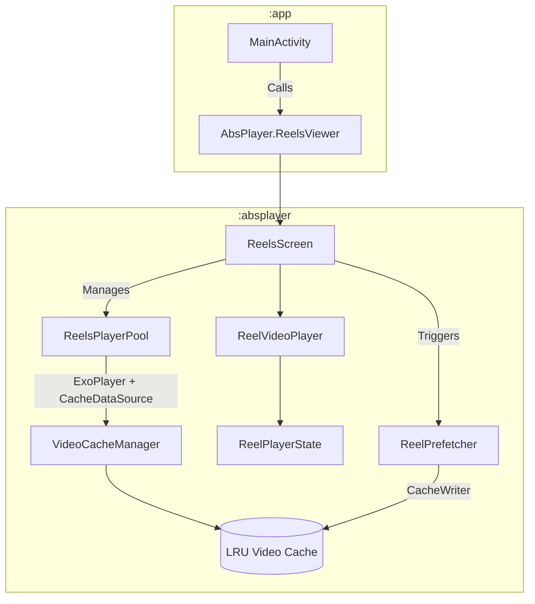

# AbsPlayer

**AbsPlayer** is a high-performance, smooth short-video (Reel/TikTok/Shorts style) playback library and sample application for Android, built natively with **Jetpack Compose** and **AndroidX Media3 (ExoPlayer)**.

---

## Overview

AbsPlayer is designed to solve the common performance bottlenecks and flickering issues associated with vertical short-form video feeds in Android applications. By combining player pooling, intelligent background video prefetching, LRU caching, and seamless vertical paging, AbsPlayer delivers a butter-smooth 60fps scrolling and playback experience.

### Key Capabilities
- **Instant Video Playback:** Eliminates buffer lag during vertical scrolling by pre-caching video streams and prefetching upcoming media.
- **Composable First:** Fully built with Jetpack Compose (`VerticalPager`, custom seek bars, animated speed indicators, and gesture detectors).
- **Modular Architecture:** Cleanly separated into a reusable library module (`:absplayer`) and a sample application module (`:app`).
- **Flexible Overlays:** Allows developers to inject custom composable overlays (likes, comments, captions, action buttons) per reel item.

---

## Features

- **Vertical Pager Feed:** Smooth vertical swiping powered by Compose `VerticalPager` with optimized `beyondViewportPageCount`.
- **Advanced Caching & Prefetching:** 
  - 500MB LRU video cache using Media3 `SimpleCache` and `StandaloneDatabaseProvider`.
  - Proactive background prefetching (`ReelPrefetcher`) for upcoming reels (`currentIndex + 1` to `currentIndex + 3`).
- **Variable Playback Speed:** Quick speed toggling (0.5x, 1.0x, 1.5x, 2.0x) via `SpeedControlButton` and a long-press gesture (hold right side of screen for 2x speed).
- **Interactive Controls & Seekbar:** Custom gesture detection for tap-to-pause/play and a responsive drag-to-seek progress bar (`ReelSeekBar`).
- **Lifecycle Awareness:** Automatically pauses playback when the app goes to the background (`ON_PAUSE`) and resumes when returning (`ON_RESUME`), cleaning up resources on disposal.

---

## Tech Stack

- **Language:** Kotlin 2.0.21
- **UI Toolkit:** Jetpack Compose (BOM 2024.09.00)
- **Design System:** Material 3 (`1.3.1`), Compose Foundation (`1.7.5`)
- **Video Player / Media:** AndroidX Media3 ExoPlayer (`1.4.1`) with HLS, DASH, UI, and OkHttp datasource extensions.
- **Concurrency & Lifecycle:** Kotlin Coroutines (`1.9.0`), AndroidX Lifecycle (`2.9.4`)
- **Build System:** Gradle with Kotlin DSL (`build.gradle.kts`) and Version Catalogs (`libs.versions.toml`).

---

## Architecture

AbsPlayer follows a clean modular architecture separating core playback logic from UI consumption.



### Data & Execution Flow
1. **Initialization:** The host application calls `AbsPlayer.init(context)` in `Application` or `MainActivity` to initialize `ReelsPlayerPool` and `ReelPrefetcher`.
2. **UI Binding:** `AbsPlayer.ReelsViewer` accepts a list of `ReelItem` data objects and an optional `@Composable` overlay lambda.
3. **Paging & Playback:** `ReelsScreen` tracks the current page in `VerticalPager`, seeks the shared ExoPlayer instance, and initiates background prefetching for upcoming videos via `ReelPrefetcher`.
4. **Caching:** Network requests flow through `VideoCacheManager` backed by Media3 `CacheDataSource` and `SimpleCache` for persistent offline/cached playback.

---

## Getting Started & Integration

### 1. Add Dependency
Include the `:absplayer` module in your project's `settings.gradle.kts` and add it as a dependency in your app module's `build.gradle.kts`:

```kotlin
dependencies {
    implementation(project(":absplayer"))
}
```

### 2. Initialize AbsPlayer
Initialize the library in your `Application` class or main activity before rendering UI:

```kotlin
class MyApplication : Application() {
    override fun onCreate() {
        super.onCreate()
        AbsPlayer.init(this)
    }
}
```

### 3. Implement ReelsViewer in Compose
Use `AbsPlayer.ReelsViewer` in your Composable hierarchy:

```kotlin
val reels = listOf(
    ReelItem(id = "1", videoUrl = "https://example.com/video1.mp4"),
    ReelItem(id = "2", videoUrl = "https://example.com/video2.mp4")
)

AbsPlayer.ReelsViewer(
    reels = reels,
    modifier = Modifier.fillMaxSize()
) { reel, playerState ->
    // Add your custom overlay (e.g. user profile, like button, caption)
    Box(modifier = Modifier.fillMaxSize().padding(16.dp)) {
        Text(text = "Reel ID: ${reel.id}", color = Color.White)
    }
}
```

---

## Project Structure

```text
AbsPlayer/
├── absplayer/                  # Reusable library module
│   ├── src/main/java/com/example/absplayer/
│   │   ├── AbsPlayer.kt        # Public entry point & singleton facade
│   │   ├── ReelsScreen.kt      # VerticalPager & lifecycle management
│   │   ├── ReelsVideoPlayer.kt # Video player surface & gesture detector
│   │   ├── cache/
│   │   │   ├── ReelPrefetcher.kt   # Background video prefetching
│   │   │   ├── ReelsPlayerPool.kt  # ExoPlayer & buffer configuration
│   │   │   └── VideoCacheManager.kt# SimpleCache & LRU cache setup
│   │   ├── data/
│   │   │   └── ReelItem.kt         # Data model for reels
│   │   └── utility/
│   │       ├── ReelPlayerState.kt  # State holder for playback parameters
│   │       ├── ReelSeekBar.kt      # Drag-to-seek progress bar
│   │       └── SpeedControlButton.kt# Variable speed selector
└── app/                        # Sample application module
    └── src/main/java/com/example/absplayer/app/
        └── MainActivity.kt     # Sample usage with sample video URLs
```

---

## License

```text
MIT License

Copyright (c) 2026 AbsPlayer Authors

Permission is hereby granted, free of charge, to any person obtaining a copy
of this software and associated documentation files (the "Software"), to deal
in the Software without restriction, including without limitation the rights
to use, copy, reside, modify, merge, publish, distribute, sublicense, and/or sell
copies of the Software, and to permit persons to whom the Software is
furnished to do so, subject to the following conditions:

The above copyright notice and this permission notice shall be included in all
copies or substantial portions of the Software.

THE SOFTWARE IS PROVIDED "AS IS", WITHOUT WARRANTY OF ANY KIND, EXPRESS OR
IMPLIED, INCLUDING BUT NOT LIMITED TO THE WARRANTIES OF MERCHANTABILITY,
FITNESS FOR A PARTICULAR PURPOSE AND NONINFRINGEMENT. IN NO EVENT SHALL THE
AUTHORS OR COPYRIGHT SUPERVISORS BE LIABLE FOR ANY EVENTANTS, DAMAGES OR OTHER
LIABILITY, WHETHER IN AN ACTION OF CONTRACT, TORT OR OTHERWISE, ARISING FROM,
OUT OF OR IN CONNECTION WITH THE SOFTWARE OR THE USE OR OTHER DEALINGS IN THE
SOFTWARE.
```
